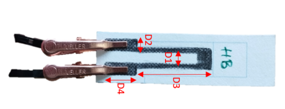
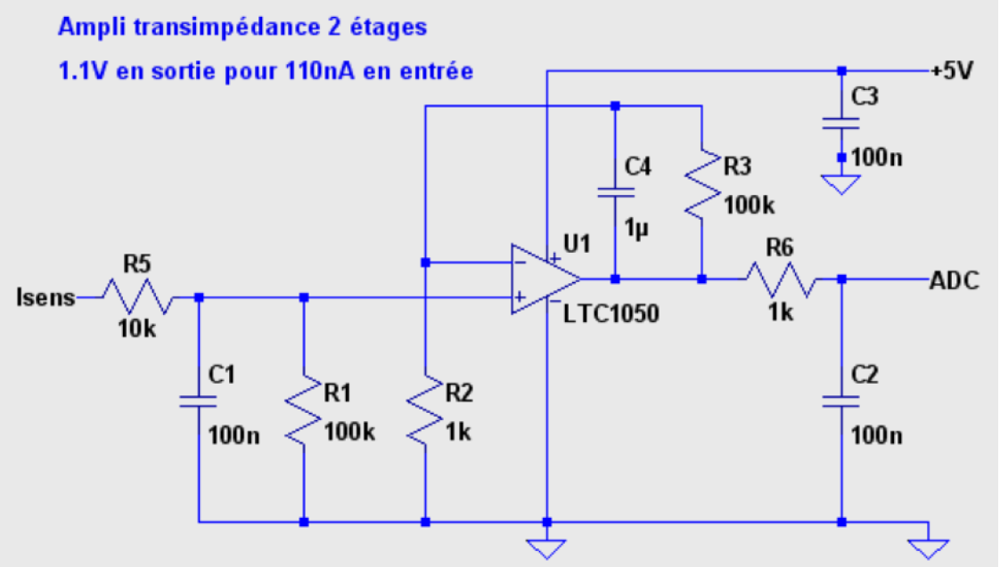

# 2022-2023-4gp-seguret_selva
## Notre projet MOSH - julien &amp; clément  
  
Dans le cadre de l'UF "Du capteur au banc de test en Open Source Hardware", nous avons été amenés à réaliser un capteur de déformation low-tech à base de graphite
Le fonctionnement de ce capteur est basé sur la variation de résistance engendrée par la déformation de celui-ci.
La physique derrière cette variation de résistance vient du déplacement des électrons par effet tunnel entre les nanoparticules de graphite.
Après avoir appliqué une contrainte mécanique, la distance entre les nanoparticules varie, entraînant donc une modification de la conductivité du graphite.
Cela induit donc une variation de résistance du capteur.  
  
Voici une image représentant notre capteur low-tech à base de graphite :  
  
  
  
Dans ce fichier nous allons décrire tous les procédés qui ont permis d'aboutir à la création de ce capteur.  
  
Table des matières :  
  
* [1. Cahier des charges](#PremiereSection)  
* [2. Simulation électronique du circuit transimpédance sur LTSpice](#DeuxiemeSection) 
* [3. Le design de notre PCB sur KiCAD](#TroisiemeSection)
* [4. Notre code Arduino](#QuatriemeSection)  
* [5. Notre application Bluetooth](#CinquiemeSection)
* [6. Le banc de test et l'élaboration de la Datasheet](#SixiemeSection)  
    
### *1. Cahier des charges* 
  
Nous sommes en binôme pour réaliser ce projet qui comprend plusieurs différents livrables :  
* Un Shield PCB au préalable designé sur KiCAD  
* Une application Android fonctionnant par Bluetooth permettant de visualiser l'évolution de la résistance du capteur en temps réel  
* Un code Arduino permettant de calculer en temps réel la variation de résistance du capteur ainsi que de contrôler les élements du PCB  
* Une datasheet regroupant les caractéristiques de fonctionnement du capteur  
  
Ainsi, afin de réaliser ce projet, il nous a été nécessaire de réaliser la simulation du capteur sur le logiciel LTSpice pour avoir une idée de l'ordre de grandeur de la résitance de celui-ci. 
Nous avons ensuite utlisé le logiciel KiCAD dans le but de designer le Shield PCB relatif au bon fonctionnement du capteur, et redigé un code Arduino
permettant le contrôle de certains éléments du Shield tels que le Flex Sensor, le module Bluetooth et l'écran OLED. Ce code Arduino nous permet également de calculer 
en temps réel la valeur de la résistance du capteur.
Après avoir effectué tout cela, nous avons créé une application APK Android permettant de connecter le module Bluetooth du PCB au téléphone de Julien, et de
visualiser l'évolution de la résistance du capteur sur un graphique en temps réel.
Enfin, la dernière étape visait à la réalisation d'une datasheet, via la caractérisation de notre jauge de contrainte.  
  
Le matériel suivant a été nécessaire à la confection de notre projet :  
* Une carte Arduino UNO    
* Un module Bluetooth HC-05  
* Un écran OLED I2C  
* Un amplificateur opérationnel LTC1050  
* Deux résistances de 100 KOhms  
* Une résistance de 10 KOhms  
* Deux résistances de 1 KOhm  
* Deux condensateurs de 100 nF  
* Un condensateur de 100 µF  
* Une feuille de papier  
* Cinq crayons à papier différents  
  
### *2. Simulation électronique du circuit transimpédance sur LTSpice*  
  
Comme nous l'avons démontré dans le document nommé [Rapport LTSpice](https://github.com/MOSH-Insa-Toulouse/2022-2023-4gp-seguret_selva/blob/main/LTSpice/Rapport%20LTSpice.pdf), le capteur ne délivrait qu'une intensité très faible (de l'ordre de quelques nF). Aussi, la carte Arduino n'est capable de sortir qu'une tension entre 0 et 5V.  
Ainsi, il nous est apparu comme nécessaire de réaliser un circuit transimpédance afin de convertir les variations de courant du capteur en variations de tension, de sorte
que la carte Arduino puisse la lire en temps réel. En parallèle de tout ça, sur ce circuit, nous avons placé quelques filtres passe-bas nous permettant de réduire les bruits
liés à la mesure, et nous permettant à l'aide d'un amplificateur LTC1050 d'amplifier le signal de sortie.  
  
Voici, la simulation de notre amplificateur transimpédance réalisé sur le logiciel LTSpice :  
  

  
### *3. L'utilisation de KiCAD en vue de la création de notre PCB*   
  
### *4. Notre code Arduino*     
  
### *5. Notre application Bluetooth*  
  
### *6. Le banc de test et l'élaboration de la Datasheet* 
  

